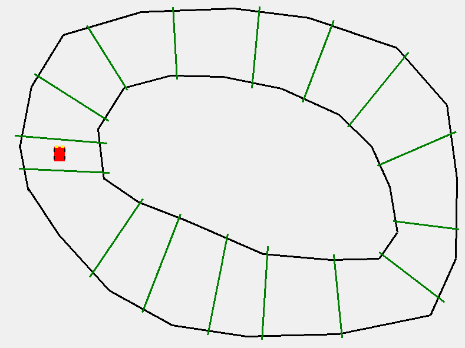
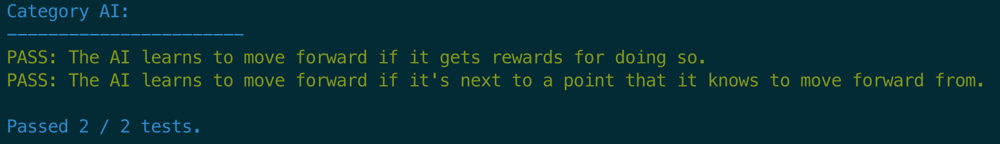

# The Story

## Tuesday, February 26
We were sitting in the back row of class, being obnoxious as usual. As Sam noticed, we'd actually ordered ourselves in j-p-a-c order (well, we were reversed, but `'jpac'[::-1]`, right?). After lecture, we started to divide ourselves up into teams to address the various parts of our project. It took way longer to come to this conclusion than it should have, but Parth and Jade decided to work together on the AI team (to design an AI to play the racing game) and Antonio and Colin decided to work together on the Graphics team (to design the interface for game playing). 

For some reason, Jade and Colin really wanted to be on their own 'Moral Support Taskforce' but as a team, we gently decided against that idea (read: moral support, my ass!).

Then, we got to work and started to write some code.

### The Graphics Journey: A Copy-Paste Legend
Colin, seemingly within two seconds, found starter code on Github for *exactly what we wanted to do* (display a screen, read input, draw things)! He copy-pasted that into the repository and then Antonio and Colin spent the rest of the time making commit jokes about Parth's pedantic code practices.

### The AI Journey: AAAAAAAH
Jade and Parth had no clue what to do. After looking at some AI libraries, they gestured Sam over and asked him for help with ideas. Sam suggested to make a very simple AI: no neural nets, genetic algorithms, or anything of the sort.

We wanted our AI to be able to 'see' the distances to each of the walls from the side of the car. It would be able to 'see' in eight directions:

(insert image here)

So, Jade and Parth thought of a simple algorithm: have the car move in the direction which it is farthest away from (think the most 'open' direction) and, to break ties, just move in a 'forward'-ish direction. They started to think about writing this in code but first had to write a `Movement` class that would interface between the graphics and backend. `Movement` would be the instantaneous direction that the car should move in (i.e., left, right, forwards, backwards, forwards-left, forwards-right, nowhere, etc.).

They started to write some code for this, and class ended pretty soon.

## Thursday, February 28 (Sam's Birthday-ish!?)

Being the dilligent workers we are, we arrived promptly at lab and instantly got to work, making massive strides towards a working game.

I'm just kidding of course. Colin was, like 30 minutes late, and everyone else wasted a good amount of time watching YouTube videos, making Parth a Genius Bar appointment (his phone just... died), and trying desperatly not to kill off another one of Jade's seven remaining brain cells.

Actually, since Parth's phone had died, he couldn't use Two-Factor Authentication to fill out the attendance code for the day, so he promised to write Sam a birthday haiku in exchange. Here's what he came up with (after Googling to remind himself about the syllable counts):
> Has a sweet, cute dog  
> Writes excellent Python code  
> Happy birthday, Sam.

Yeah, he's not a poet. Although... Sam's response:
> THANK YOU!  
> I love it.  
> --Sam

### The Graphics Journey: Interactive Map Generation and A Promising Start

Antonio and Colin split the Graphics into two pieces: making a racetrack for the car to drive on (which they called a 'map') and writing dynamics for the car. Antonio worked on the first and Colin worked on the second.

By the end of the day, Colin had implemented a `Car` class which drew a car from its ) coordinates and a rotation variable. You can't control it yet, but it's getting there!

Antonio, working separately, wrote a Python script where, by clicking on the screen, users could design their own maps with their own 'reward gates' and its own start point. The program pickled the files and stored them in the root directory, the idea being that you could later load the file into the main script and display the map to the user. 

By the way, the 'reward gates' are a concept that the AI team requested: for Q-learning algorithms, the idea is to train an AI by giving it punishments or rewards for doing certain actions. The most natural punishment for this type of game is to punish the AI if it runs into a wall. The most natural reward would be to reward the AI for, say, driving around the entire racetrack. The problem, though, is that an AI put in this situation is supposed to be able to randomly stumble upon the rewards. It learns by doing the things that it randomly stumbled upon again and again and slowly getting better at them. If the only reward was for getting *all the way around the track*, the AI could never stumble upon it randomly and would never learn anything.

The pickling worked successfully, and, later that night, Parth managed to import Antonio's map that he'd created on his laptop onto Parth's laptop (which is pretty cool!).

### The AI Journey: We made... a parachute

Things were moving more slowly with the AI team. Jade had roughly seven brain cells remaining after a late night and a stressful week. Parth and Jade got to work on finishing the AI they'd started last time. By 'got to work', I mean Parth peered over Jade's shoulder at her computer and they talked about / wrote code together.

This process was not the most efficient... at one point, they were passing the laptop back and forth every two lines of code because Parth was making fun of the way Jade types (instead of keeping four fingers on the keyboard, her pointer fingers float in the air, pointing at the screen, as though they're really excited about what Jade is typing). It was long, but they got it done. They implemented the *entire* (backup) AI! The AI, which I've described before, works by measuring the distance to the walls in eight directions. It moves in the forward-ish direction towards which it is farthest away from the wall.

This was like... 10 lines of code?

After that, they kinda relaxed, focusing on next steps. They were deciding whether to build a slightly-more-advanced, perhaps-still-hardcoded AI or to take on a much more advanced algorithm like Q-learning. As Jade described the second option, "now that we've built a parachute, we can go skydiving." So, they watched YouTube videos and played [qwop](http://www.foddy.net/Athletics.html) until the day was over.

Jade promised her brain cells would regenerate by Saturday, so the AI team planned to meet again then.

## Saturday, March 2
Parth and Jade met up to work on / actually implement the AI. They'd both thought a little bit about how they thought the AI would be best implemented.

Jade was thinking about writing an AI based on an algorithm from Stanford's CS 168. In that class, students write an MCMC-based algorithm to play QWOP, the game Parth and Jade were playing on Thursday (see [Markov Chain Monte Carlo](https://en.wikipedia.org/wiki/Markov_chain_Monte_Carlo)). After some investigation, though, she determined that this was probably not the best method to approach our problem because the goal of QWOP never changes: go forward. Our problem had more complexity.

Parth thought about this from a more mathematical background: the car can see the distances to the walls in eight directions and also knows its velocity, a two dimensional vector. This means that the current 'state' of the game is characterized by 10 numbers. I.e., the geometric 'space' of all possible states is some subset of  (Parth wanted to analyze this as a manifold, but that idea was quickly shut down). The idea would be to build a function  which accepts the state and action (a number from zero to eight) and spits out the 'reward' (either positive or negative) that the car recieves from performing that action from that state. Then, the car could just pick whichever action gives the highest value by computing ,%20\\dots,f(s,8)).

The two ended up going with Parth's idea. Implementing this in code would require two main components:

1. Maintain and store a dictionary that associates a pair `(state, action)` to a number, `reward`.
2. Approximate the estimated reward at a point you don't have information about based on previous information.

Both of these ideas were informed, roughly, by [Q-learning](https://en.wikipedia.org/wiki/Q-learning). In this case, we have a 'continuous state space' (as opposed to discrete) which makes it more difficult to use traditional Q-learning methods.

### Reinventing the Wheel... Including the part where you're on a hillside and the wheel rolls backwards, crushing you underneath...
Parth and Jade decided to make their own Q-learning-based algorithm, from scratch. They 'approximated' the value at a point by summing up the values at *all of the other points* and weighting each value by a value inversely proportional to its distance from the current state they were trying to guess a good action for. They weighted the points by  where  was the distance of the point in the table from the point they were trying to approximate.

The exponential function is a modified normal distribution (or, as Jade likes to say, "it's short and FAAAAT" [pronounced in the most contrived, Southern accent you can imagine]) that is equal to  when  and falls off away from that point.

There are a few problems with this... The first red flag is that it doesn't look *anything* like the traditional Q-learning algorithm which is based off the equation:

	

The second red flag is that if there are, say, 10 entries in the table which have states that are roughly in the same region, that value will be multiplied by 10, even though it really only makes sense to consider it once. This might be a very big issue if we were trying to accurately approximate the expected reward from a particular action but we only really care about which action will give us the largest reward, which this shouldn't really affect too much.

The third problem is that our algorithm learns VERY fast. As soon as it has data in its table, it's relying entirely on that in its future judgements. This is generally a bad idea in machine learning, but probably not too difficult to fix in a pinch (maybe they could make their algorithm learn at a rate proportional to the size of the Q-table).

But, all said and done, the algorithm worked(...ish...)! Without any data, Jade and Parth wanted the car to default to moving forward. Because of the way Python sorts lists, it went *every direction except forward* before it went forward. It was kinda like pushing a grocery cart at a store: it moved in every direction they didn't want it to move, including backwards, before, after wrestling with it, it finally moved forwards. Well, I say 'wrestling'... it was mostly this:
> Jade: "We could hardcode it."  
> Parth: "Great! You got this, Jade!", he said, in an attempt to usurp Jade's moral-support role.  
> Jade: 🤨

There were still a few kinks to iron out when the two left, but they figured out nice solutions to many of those kinks and, though they haven't pushed the changes (as of right now), they should have that done soon.

## Monday, March 4

Colin and Antonio had intended to get work done on the Graphics portion of the project after the AI team's rather successful Saturday. But, like, nobody has any time in Week 9 and Colin had other things on his mind including his presentation for PWR... While Parth was enjoying lunch, Colin called him to ask for his input about whether he should wear a *sports coat* with his *polo and jeans*. "The sports coat restricts my movement," Colin complained. Parth was happy with this objection because he, in his old-minded, traditionalistic ways, believes that polos under sports coats are absolutely disgusting. Exhibit A:

	

Later that night, Parth came over after Colin texted him that he'd left his plate in Antonio's room. To his horror, Colin was wearing a blue polo with Bobcats-themed athletic shorts. This led to a long discussion about whether wearing a polo with athletic shorts was acceptable. Parth thought not, but after seeing this picture he kind of changed his mind...

	

**Anyways, back to your regularly scheduled...programming 😜.** While Colin and Parth were goofing off, Antonio had finished writing two files: the `mapCreator.py` file, which allows you to build custom maps, and the `utils.py` file, which allows you to do very useful things like compute intersections of lines, etc.

Unfortunately, Antonio was having some trouble since, trying to follow Parth's branch schema, he was working on a branch called `Graphics/Algebra`. The slash in the branch name was causing some issues where git was failing to lock refs and, as a result, Antonio had a lot of unpushed commits. Parth fixed the branch issue by merging into another branch and deleting the older branch. Due to some miscommunication, Antonio's changes were never pushed and the last two days of work were lost.

It's alright. He didn't do *thaaat* much. Or, at least, because of Antonio's incredible brainpower, he was able to replicate all of the code (sans comments) within 20 minutes. He also designed a nice, donut-shaped map:

	

(I might have added the car in Photoshop, but it's still pretty cool, okay!)

At the same time, Colin and Parth got involved in a discussion about the physics of the car they were modeling. They spent a lot of time rederiving equations they'd learned in high school physics. Well, Parth did, at least... let's just blame it on the Texas public school system. After getting his bearings, Colin went to bed.

### A brief aside on Parth's not-so-secret obsession
If you haven't figured it out by now, Parth **loves** commenting. I think he writes more comments than he does code. Even on tests! Parth treats CS tests like they're PWR essays. In his free time, he'll *read back over the code* that others have written and *add comments to it*! As far as we can tell, he's always been this way. Many of us suspect that he was bitten by a radioactive Supreme Court Justice and now can't stop himself from writing an obscene amount of unnecesary information next to functional code. He definitely wants to turn his codebases into legal documents...

## Thursday, March 7
Alright, it's been a while, so let me get you up to speed:

1. On Tuesday, Antonio wrote a function that returns the distances to the eight points that the car is allowed to see in. Antonio and Colin found some nice template code for driving a car, and after that, Colin got the car moving! (Well, sort of... he didn't know the parameters for `pygame.draw` and ended up drawing a rectangle that, instead of just moving forward, also changed in size...)
2. On Tuesday, Jade and Parth added an element of randomness to their Q-learning algorithm so it learns more slowly.
3. On Wednesday, Colin had finished making the car move correctly. He hadn't implemented rotation yet, so the car behaved a little strangely, but it was looking pretty good!
4. Wednesday night, Parth made his own testing suite for the project so the team could easily write and run tests on their AI. He giddily barged into Antonio and Colin's room at 1am while they were getting ready for bed and insisted on showing it to them. It's not bad... but like... also not very useful for the Graphics team...

	

He spent an obscene amount of time trying to get the colors to display correctly...
5. On Thursday, Parth and Jade redesigned their algorithm so the AI didn't have to loop over **every single data point** every time it made a decision; they decided to rescale the distance and velocity vectors so that each of the entries in the distance vector was a number from 0 to 11 and each of the entries in the velocity vector was a number from 0 to 10. The two vectors together give a vector with 10 entries. All of the possible distance/velocities (i.e. all of the possible **states**) can be represented as an 11 x 11 x ... x 11 x 10 x 10 table! Then, there are 8 possible actions. So, all possible `(state, action)` pairs live in a 11 x 11 x ... x 11 x 10 x 10 x 8 table. This kind of structure, in this context, is usually called a **q-table**. Parth and Jade wanted to implement this in the following way:
	1. Initialize the table with all entries equal to zero.
	2. Whenever the algorithm performs `action` from a particular `state`, update the value of the table at `(state, action)` based on the reward that the algorithm recieved from performing that action.
	3. Update *all of the neighbors* of that point in the table! This step is important so the algorithm is learning in a "continuous" rather than "discrete" way.
	4. To predict the value of the reward for `(state, action)`, just pull the number out of the q-table.
6. That same day, Antonio started to write a function to train the AI and Colin got rotation down...sort of... Currently, if you rotate it for more than 3 seconds, it spins into a black hole of death (I estimate its rotational velocity at around 25mph).

> With <3 by @jpac